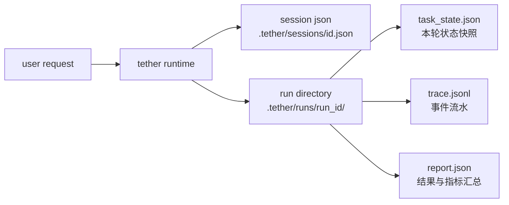

# 07-会话状态、运行工件与恢复机制设计

## 背景

本地 code agent 一旦开始处理真实仓库任务，很快就会碰到三件事：

- 跑到一半中断了，下一次怎么接着来

- 跑完以后结果不对，怎么回看过程

- 做 benchmark、做聚合、做面试展开时，证据从哪里拿

这三件事看起来像一类问题，实际上不是同一层。恢复现场需要的是还能继续工作的状态，复盘和审计需要的是可回看的运行证据。`Tether` 这一层做的，就是把这两类东西分开。

## 这篇要解决什么问题

问题可以压成一句话：

**为什么 ****`Tether`**** 要把会话状态和 run 工件拆成两层，以及这两层各自解决什么问题。**

这里的 run 工件，指的就是每次 `AgentLoop.run()` 跑完后单独写入 `.tether/runs/<run_id>/` 下面的几份运行产物，主要是 `task_state.json`、`trace.jsonl` 和 `report.json`。

这里真正要回答的是四件事：

- session 在保存什么

- run artifact 在保存什么

- `--resume` 到底恢复了哪一层

- 为什么 `task_state`、`trace`、`report` 要分开写

如果这几件事讲不清楚，运行状态设计就很容易被看成反正都存成 JSON 了，看不出这层工程取舍。

## Tether 为什么要分两层

`Tether` 现在把运行状态分成两层。

- 第一层是 session

- 第二层是 run artifact

session 回答的是，以后还能不能继续干。
run artifact 回答的是，刚才到底发生了什么。



这张图里最重要的点就一句话，session 和 run artifact 虽然都在存状态，但回答的不是同一个问题。

## session 这一层在存什么

session 持久化在 `tether/session_store.py` 的 `SessionStore`。

路径很简单：

```
.tether/sessions/<session_id>.json
```

这个 JSON 里现在最关键的字段有这些：

| 字段 | 作用 |
| --- | --- |
| `id` | 会话 id |
| `created_at` | 会话创建时间 |
| `workspace_root` | 当前工作区根目录 |
| `history` | 完整会话记录 |
| `memory` | 工作记忆 |

也就是说，session 里保存的是下一轮继续工作还会用到的状态。

`SessionStore` 的实现也很轻：

```
class SessionStore:
    def path(self, session_id):
        return self.root / f"{session_id}.json"

    def save(self, session):
        path = self.path(session["id"])
        path.write_text(json.dumps(session, indent=2), encoding="utf-8")
        return path

    def load(self, session_id):
        return json.loads(self.path(session_id).read_text(encoding="utf-8"))
```

这层没有数据库，也没有复杂索引。对 `Tether` 这个体量来说，这个取舍很实际，先把恢复做直接，比先把存储做复杂更重要。

## run artifact 这一层在存什么

每次 `AgentLoop.run()`，`RunStore.start_run()` 都会创建一个 run 目录：

```
.tether/runs/<run_id>/
```

当前核心工件有三类：

| 文件 | 作用 |
| --- | --- |
| `task_state.json` | 当前这轮运行的状态快照 |
| `trace.jsonl` | 运行过程中的逐事件时间线 |
| `report.json` | 这轮结束后的聚合摘要 |

对应代码在 `tether/run_store.py`：

```
def task_state_path(self, run_id):
    return self.run_dir(run_id) / "task_state.json"

def trace_path(self, run_id):
    return self.run_dir(run_id) / "trace.jsonl"

def report_path(self, run_id):
    return self.run_dir(run_id) / "report.json"
```

这一层和 session 的区别很清楚，run artifact 负责的是审计、回放和聚合。

## 为什么每次主循环都要新开一个 run 目录

`AgentLoop.run()` 一开始就会创建：

- 一个新的 `TaskState`

- 一个新的 `run_id`

- 一个新的 run 目录

主线在 `tether/runtime.py`：

```
task_state = TaskState.create(
    run_id=self.new_run_id(),
    task_id=self.new_task_id(),
    user_request=user_message,
)
self.current_task_state = task_state
self.current_run_dir = self.run_store.start_run(task_state)
```

这一步很值，因为它把一次用户请求和一组独立工件绑定死了。

后面你做排查、看 trace、聚合 metrics，都不需要再从一整个会话里猜边界。run 的边界在文件系统上就是独立的。

## task_state 为什么是快照

`tether/task_state.py` 里的 `TaskState` 保存的是这轮运行此刻的中心状态。

当前关键字段有这些：

- `status`

- `tool_steps`

- `attempts`

- `last_tool`

- `stop_reason`

- `final_answer`

它的职责是回答现在这轮跑到哪了。

比如：

- `attempts` 记录模型已经被调了多少轮

- `tool_steps` 记录真正执行了多少步工具

- `stop_reason` 记录最后为什么停

- `final_answer` 记录最后答案

这就是为什么 `task_state.json` 更像快照，不像日志。

你想先知道这轮为什么停，先看它就够了。

## trace 为什么要单独用 jsonl

`RunStore.append_trace()` 现在是 JSONL 逐条追加，不是最后一次性写整份 trace。

```
with path.open("a", encoding="utf-8") as handle:
    handle.write(json.dumps(event, sort_keys=True, ensure_ascii=True))
    handle.write("\n")
```

这个做法很朴素，但很适合 agent 运行过程。

因为 trace 天生就是事件流，比如：

- `run_started`

- `prompt_built`

- `model_requested`

- `model_parsed`

- `tool_executed`

- `run_finished`

这类数据按 JSONL 写有几个好处：

- 运行中就能持续落盘

- 中途异常时，不容易整份 trace 都没了

- 后面做聚合时，顺着事件扫就行

所以 trace 这层负责回答的是，过程里发生过什么。

## report 为什么还要单独写一份

有了 `task_state` 和 `trace`，为什么还要再写 `report.json`？

因为前两者都更像原材料。

- `task_state` 适合看当前状态

- `trace` 适合看过程细节

真正做聚合、benchmark、resume metrics 时，更顺手的是一份已经收过的结果摘要。

`build_report()` 当前会把这些关键字段写进去：

- `run_id`

- `task_id`

- `status`

- `stop_reason`

- `final_answer`

- `tool_steps`

- `attempts`

- `task_state`

- `prompt_metadata`

代码在 `tether/runtime.py`：

```
return {
    "run_id": task_state.run_id,
    "task_id": task_state.task_id,
    "status": task_state.status,
    "stop_reason": task_state.stop_reason,
    "final_answer": task_state.final_answer,
    "tool_steps": task_state.tool_steps,
    "attempts": task_state.attempts,
    "task_state": task_state.to_dict(),
    "prompt_metadata": self.last_prompt_metadata,
}
```

所以 `report` 这层更像给聚合脚本和实验统计准备的成品层。

## resume 到底恢复了什么

恢复走的是 `Tether.from_session()`，CLI 则通过：

- `--resume <session_id>`

- `--resume latest`

把这个入口接起来。

`build_agent()` 里的逻辑是：

```
session_id = args.resume
if session_id == "latest":
    session_id = store.latest()
if session_id:
    return Tether.from_session(...)
```

这里有个点很重要，恢复的时候做的是下面这几件事：

- 重新构造新的 `Tether`

- 重新注入当前 `model_client`

- 重新注入当前 `workspace`

- 把旧的 `session` 状态读回来

也就是说，resume 恢复的是会话状态，不是进程本身。

这个边界其实很干净。session 需要可序列化，provider client 和 runtime 对象本身不需要。

## 这一层现在怎么被验证

### 第一类是 run store 行为测试

`tests/test_run_store.py` 现在已经覆盖了：

- `start_run()` 会创建 run 目录和 `task_state.json`

- `append_trace()` 会按 JSONL 追加事件

- `write_report()` 会写出 `report.json`

- 缺失最终 report 的 run 目录也能被容忍

### 第二类是运行闭环测试

`tests/test_tether.py` 现在已经覆盖了：

- 一次 `AgentLoop.run()` 结束后会留下 `task_state.json`、`trace.jsonl`、`report.json`

- `task_id` 和 `run_id` 会分开

- `run_finished` 会出现在 trace 里

- secret 会在 trace 和 report 里被脱敏

- session 可以被保存再恢复

也就是说，这层状态闭环现在不是只停在设计图上，代码和测试都已经把关键行为钉住了。

## 这一层现在没做什么

- session 还是单文件 JSON，没有更复杂索引

- session 和 run 的关联关系还比较自然，没有单独抽一层索引

- run artifact 还没有 schema version

- resume 还没有更复杂的一致性检查

这些都不是 bug，更像后续可以继续往前走的点。

## 如果继续往下做，优先怎么补

我会优先补三件事。

### 一，给 run artifact 加 schema version

benchmark 这边已经有版本意识了。后面如果 trace 和 report 结构会继续演进，run artifact 也值得单独带版本。

### 二，把 session 和 run 的关系再写得更显式

现在已经能串起来，但如果以后要做跨会话分析，关联字段可以更明确一点。

### 三，给 resume 加更多一致性检查

如果后面 workspace 和 memory 结构变复杂，恢复时多做几项一致性检查会更稳。

## 面试里怎么讲这一层

Tether 这里把运行状态拆成了两层。session 负责保存还能继续工作的状态，比如 history 和 memory；run artifact 负责保存刚才这轮到底发生了什么，所以每次 `ask()` 都会单独写出 `task_state.json`、`trace.jsonl` 和 `report.json`。`task_state` 负责看现在跑到哪了，`trace` 负责看过程里发生了什么，`report` 负责给后面的聚合和实验统计提供摘要。这样恢复和复盘就不会混在一起，agent 也不只是当场跑完就结束。

## 总结

`Tether` 的这一层设计，核心是把还能继续工作的状态和能回看的证据分开。

session 负责延续会话，run artifact 负责记录单轮执行。这样一来，agent 不只会跑，也更容易恢复、更容易复盘、更容易拿去做 benchmark 和面试展开。