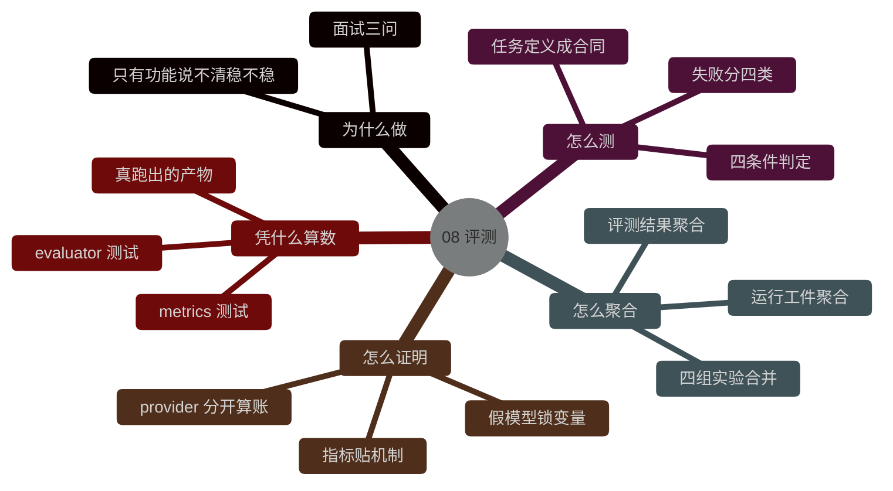

# 08-评测框架与实验方法设计

## 背景

如果一个 agent 项目只有**模块**介绍，没有评测方法，最后很容易掉进一个很尴尬的状态。

你能展示它做成过几次事情，但你说不清这些成功是偶然还是稳定；你也能讲自己做了上**下文治理、记忆、工具治理**这些模块，但你很难回答它们到底有没有带来可测的收益。

对面试来说，这个问题更现实。面试官真正想听的，往往不只是你做了哪些模块，还包括：

- 你怎么知道**它跑对了**
- 你怎么比较**不同机制的收益**
- 你怎么避免**自己给自己打高分**

这篇主要讲的是，`Tether` 怎么把评测做成一条**能落地、能复盘、能聚合**的证据链。

## 这篇要解决什么问题

问题可以压成一句话：

agent 项目里，怎么把我觉得它还行变成一套有**任务合同、有判定标准、有失败解释**的评测方法。

这里真正要回答的是四件事：
- benchmark 任务是怎么被定义成**可执行合同**的
- 单条任务怎么被判定**通过或失败**
- 运行过程里的工件怎么继续被**聚合成指标**
- 为什么不同机制不能都拿**同一个大指标**去证明

## Tether 的评测链路长什么样

当前 `Tether` 的**评测链路**可以拆成三层。
1. 第一层   题库层          固定 `benchmark` 任务集
2. 第二层   评测执行层      `BenchmarkEvaluator`
3. 第三层   指标汇总层      `evaluation/metrics.py` 里的聚合和实验层

![[Pasted image 20260926163628.png]]

这张图最重要的地方是，`Tether` 不是只算一个 `pass rate` **通过率**。
它前面有**任务合同**，中间有**执行器**，后面还有**工件聚合和实验层**。这样最后的数字才有上下文。


## benchmark 任务 先被定义成合同
> 「帮我改一下 README」这种话没法验收——在哪儿改、改到什么程度、算不算改好，全靠人看着说。
> 所以第一步是把它变成一条机器能照着执行的合同

固定任务 定义在 `benchmarks/coding_tasks.json`。
现在一条任务至少长这样：
```json
{
  "id": "readme_intro_locked",                           // 任务编号
  "prompt": "In the README fixture, replace the placeholder opening sentence with 'This fixture is a locked benchmark workspace.'",
                                                          // 给模型的原话
  "fixture_repo": "tests/fixtures/bench_repo_readme",     // 起点仓库
  "allowed_tools": [                                      // 允许用的工具
    "read_file",
    "patch_file"
  ],
  "step_budget": 4,                                       // 最多几步
  "expected_artifact": "README.md opening sentence is ...",// 期望产物（人话备注）
  "verifier": "python3 -c \"...\"",                        // 判定命令
  "category": "documentation"                             // 所属类别
}
```

这几个字段一起出现以后，任务就不再只是请你改个 README，它会变成一个**有约束、有环境、有验证方法**的执行单元。

这就是 `validate_benchmark()` 在做的事情，把**自然语言任务拉成一条明确合同**。

## 为什么 evaluator 要复制 fixture

> **背景**：评测要的是"同一道题每次都能从同样的起点跑"。
> 原目录被上一次跑改过之后，起点就变了——两次结果没法比，判定甚至可能变成假通过（要断言的那句话本来就已在文件里）。

`BenchmarkEvaluator.run_task()` 每次执行任务，都会先把 fixture repo 复制到新的工作目录，再在 副本里启动 agent。

这一步很重要，因为 benchmark 的目标**不只是跑通一次**，它还得保证同一份任务能被反复测，而且环境一致。

主线代码就是这样：
```python
# 找到起点仓库（从题库配置里读）
fixture_source = self.repo_root / task["fixture_repo"]

# 副本放在哪：临时工作区 / 题号 / 仓库名
fixture_copy_root = self.workspace_root / task["id"] / fixture_source.name

# 复制一份，agent 只在副本里干活
shutil.copytree(fixture_source, fixture_copy_root)
# 用副本建工作区，显式指定仓库根（免得往上找到错的）
workspace = WorkspaceContext.build(
    fixture_copy_root,
    repo_root_override=fixture_copy_root,
)
```

这套做法解决的是**任务污染问题**。前一轮改过的文件，不应该影响后一轮的判定。


## scripted baseline（假模型）为什么很重要

> 真模型每次输出都不一样。同一个实验跑两遍，结果就不同——改了一行代码再看数字，分不清是改动生效了，还是这次运气好。

当前 evaluator 默认优先走 `FakeModelClient` 加 `SCRIPTED_MODEL_OUTPUTS`。

这层设计很值，因为它先把 harness 自己的**正确性和真实模型波动拆开**了。

如果一上来就绑真实模型，很多问题会混在一起：

- 是 runtime 有问题
- 还是**模型**随机波动
- 是 verifier 写得有问题
- 还是任务合同本身不稳

作用： `FakeModelClient` 的存在，让 benchmark 能先回答一件更基础的事，给定**固定输出，运行时、工具链、verifier、artifact 这条链** 能不能稳定跑通。

所以 `09` 这一层不能只看真实 provider。`scripted deterministic baseline` 本身就是评测方法的一部分。


## 一条任务到底怎么判定通过
> **背景**：模型说做完了不等于真做完了，判定得看东西对不对。


`BenchmarkEvaluator.run_task()` 跑完以后，不会只看模型有没有回一句 Done，它会看**几件条件**的交集。

代码就在这里：
```python
# 步数没超上限
within_budget = task_state.tool_steps <= int(task["step_budget"])
# 判定命令跑通了
verifier_passed = verifier.returncode == 0
# 是正常收尾停的
non_failure_stop_reason = task_state.stop_reason == STOP_REASON_FINAL_ANSWER_RETURNED
# 四条全满足才算过（第三条 expected_artifact_exists 在上面算好）
passed = within_budget and verifier_passed and expected_artifact_exists and non_failure_stop_reason
```

这四个条件缺一个，这条任务都不算 pass：
- 没超预算
- verifier 通过
- 期望工件存在  （**这次任务要求产出的那个文件**）
- stop reason 正常

这样做的好处很直接，agent 说自己做完了，不代表真的算完成。评测层看的是一组显式条件。

```
"它跑对了吗？"
→ 不看它说什么，看四条：没超步数、判定命令通过、产物真的在、是正常收尾停的。
  四条全过才算过。
```

## failure category 为什么要单独留下来
> 只知道"没过"，修的时候只能猜。同样 7 道没过，可能是七个不同原因——超了步数、内容改错、还是压根没产出东西。不分类，这 7 道只能一起看，等于没看。

```python 
pass / fail  只告诉你"出事了"，
failure category 告诉你"出的是什么事"。
```

评测如果只留一个` pass / fail`，很快就会不够用。

当前 evaluator 在**失败时**还会进一步归类：` if else `判断
- `missing_artifact`  **缺产物**
- `budget_exceeded`  **超步数预算**
- `verifier_failed`  **检查未通过**
- `failure_stop_reason`  **收尾异常**

```
产物都没有        →  最基础的一层，先归它
产物在，但超步数   →  活干得太多
产物在、没超步数，但内容不对  →  干错了
前面都对，只是收尾方式不对    →  最轻的一档
```

这一层很关键，因为它会把**失败继续拆成为什么没过**。后面做回归、做面试表达、做不同版本对比，才不会停留在一个模糊失败上。


## benchmark artifact  **评测结果记录** 为什么不只是 summary
> **背景**：光存一个分数，过阵子就说不清它是怎么来的、还能不能比。

`BenchmarkEvaluator.run()` 最后会写出完整的 artifact（评测结果记录），不只是一份 summary（汇总）。

它里面除了**通过率**，还会带：

| 字段                   | 中文          | 记的是                |
| -------------------- | ----------- | ------------------ |
| commit 和 branch      | **代码版本**    | 哪一次提交、哪个分支         |
| benchmark 来源         | **题库来源**    | 用的哪份题目文件           |
| fixture snapshot id  | **起点快照指纹**  | fixture 文件内容算出来的哈希 |
| model name / version | **模型名字和版本** | 哪个模型、哪一版           |
| decoding 参数          | **采样参数**    | 温度、top_p、最大生成长度这些  |
| timezone 和 locale    | **时区和语言环境** | 跑的时候机器的时间区和语言设置    |
| 每条 task 的完整 row      | **逐题明细**    | 每道题的完整记录（不只一个总数）   |

`fixture_snapshot_id`——它把 fixture 里所有文件的内容算成一个哈希值，用一串字符代表"这道题的起点长什么样"。

这说明 `Tether` 不是只在算结果，也在尽量保住**复现上下文**。

后面你看到一组 **benchmark** 数字，至少知道它是在哪**份任务、哪套 fixture、哪次代码状态**下跑出来的。

```python
情况一
  通过率 58%
  fixture_snapshot_id = 3a7f9c2e      ← 一样
  → 起点没变，这个进步是代码改出来的   ✓ 这份对比成立

情况二
  通过率 58%
  fixture_snapshot_id = b81d4f0a      ← 不一样
  → 起点被改过了
  → 这份成绩不能跟上一份直接比         ✗ 先查为什么起点变了
```

## metrics（指标）层在做什么

evaluator（评测器）管的是"单条任务判没判过"，
`tether/evaluation/metrics.py`（指标层）管的是"**多**条结果怎么汇总起来，不同机制怎么互相比"。

它现在主要做三类事：
	汇总评测结果         把 benchmark artifact 聚成 **通过率、平均步数、失败类别分布、per-step 轨迹指标**
	汇总运行记录         把 run artifact 聚成**重试次数、工具步数、缓存命中、耗时、工具状态、安全事件、轨迹指标**
	跑功能消融和对照实验   关掉某个功能再跑一遍，看对应指标变没变

具体是：
- `aggregate_benchmark_artifact()`：把**评测结果**汇总成**通过率、平均步数、失败类别分布**，并透传 `summary.trajectory` 的 per-step 轨迹汇总
- `aggregate_run_artifacts()`：把**运行记录**汇总成**重试次数、工具步数、缓存命中、耗时、工具状态、安全事件**，并逐 run 计算**轨迹指标**再平均
- **记忆、上下文、安全、模型后端**这几组实验，结果最后会汇总成统一口径，能直接拿去**写简历、写报告**

这层做完了，评测就不止是一份躺在硬盘上的原始结果——
它能继续长成**指标和报告**，也就是能比较、能讲、能写进简历的东西。


## 为什么不同机制不能都用同一个大指标


这一点在 `Tether` 里其实做得很对，不是所有模块都硬拿**成功率**去证明。

举几个例子：
- 上下文治理     看 `prompt_chars`（每轮提示词的字符数）、压缩率
- 记忆层         看 重复读取次数、`follow-up` 工具步数 (后续还要调几次工具)
- 安全治理       看 拦截事件次数、错误码分布
- 模型后端对照    才看 `pass_rate`（通过率）/ `avg_attempts`（平均尝试次数）/` avg_tool_steps`（平均工具步数）

也就是说，`Tether` 的**评测层**不会只产出一个大指标，它会尽量让**指标**贴机制本身。

这一点很重要。什么都用 **pass rate** 去证明，最后反而讲不清楚每个设计到底带来了什么。


## run artifact  **运行工件**  为什么也要进评测链

只讲 benchmark 还不够。

因为 `Tether` 还有一类很重要的输入，不只 benchmark artifact，还有运行时自己的工件：

- `task_state.json`       **任务状态**：这次跑成什么样（走了几步、重试几次、为什么停）
- `trace.jsonl`           **运行轨迹**：一步步做了什么，一行一个事件
- `report.json`           **运行报告**：这次运行的汇总（用了哪份存档、提示词元信息、记忆沉淀）

`aggregate_run_artifacts()` 会把这些工件继续聚成：

- `avg_tool_steps`        **平均工具步数**：平均调了几次工具
- `avg_attempts`          **平均尝试次数**：平均重试了几次
- `cache_hit_rate`        **缓存命中率**：提示词前缀被复用上的比例
- `tool_status_counts`    **工具调用结果分布**：成功 / 被拒 / 出错各几次
- `security_event_counts` **安全事件计数**：拦截、审批拒绝各几次
- `stop_reason_counts`    **停止原因分布**：正常收尾 / 超步数 / 出错各几次
- `trajectory`            **per-step 轨迹指标**：从 `trace.jsonl` 事件流逐 run 算出再平均（口径见下）

这层做完以后，评测就不再只是任务过没过，还会继续回答它是怎么过的，或者为什么会停在那里。

（也就是说：结果一样的两道题，加上过程记录才分得出"干净利落过的"和"勉强过关的"）

### per-step 轨迹指标的口径

四个轨迹指标都由 `compute_run_trajectory_metrics()` 从单个 run 的 `trace.jsonl` 事件流算出，随固定 benchmark 的每个 row 落进 artifact，再由 `summarize_trajectory_metrics()` 聚进 `summary.trajectory`；`aggregate_run_artifacts()` 对任意 runs 目录走同一套函数。口径精确定义如下：

- **工具选择正确率 `tool_selection_accuracy`** = `(tool_calls - invalid_tool_calls) / (tool_calls + retry_count)`。分子是"解析成功、参数过校验、执行没报错"的调用；分母把"想发起动作但解析失败"的 retry 轮也算作一次工具调用尝试。已知缺口：`model_parsed` 事件不记录 retry 的具体原因，事件流层面区分不了 malformed tool 和空 final/空响应，统一按"未产出可执行动作"计入分母。分母为 0（一轮直接给 final、没发起任何工具动作）时该指标为 `null`，聚合时跳过，不硬造 0 或 1。
- **重试次数 `retry_count`** = `kind="retry"` 的 `model_parsed` 事件数（含 malformed tool 降级重试、空 final、空响应）。
- **循环深度 `loop_depth`** = `model_requested` 事件数，即模型调用轮数；`loop_depth_ratio` = `loop_depth / max_steps`。`max_steps` 未知的聚合场景（如任意 runs 目录）比例为 `null`，不伪造。
- **无效调用数 `invalid_tool_calls`** = `tool_status` 为 `"error"` 或 `"rejected"` 的 `tool_executed` 事件数（参数校验失败、审批拒绝、重复调用拦截、执行异常）。`partial_success` 不算无效——工作区已按预期改变，它的错误码在 `tool_error_code` 里单列。

### 每任务成本与缓存节省的口径

轨迹指标回答「过程对不对」，成本指标回答「跑一次花多少钱」。两者用同一份数据：`model_parsed` 事件里的 `completion_metadata`。真实模型路径上，DeepSeek 的 Anthropic 端点除了 `input_tokens` / `output_tokens` 还返回 `cache_creation_input_tokens` 与 `cache_read_input_tokens`（服务端自动上下文缓存的写入量与命中量），客户端把它们提取进 metadata。注意 Anthropic 口径里 `input_tokens` 不含缓存命中部分：未命中输入 = `input_tokens`，命中输入 = `cache_read_input_tokens`，两者相加才是这次调用的总输入。

价格表在 `tether/evaluation/cost.py` 的 `DEEPSEEK_FLASH_PRICES`，来源是 DeepSeek 官方定价页（2026-10-05 读取），单位美元每百万 token：输入缓存命中空闲 0.003 / 高峰 0.006，未命中空闲 0.15 / 高峰 0.30，输出空闲 0.60 / 高峰 1.20。高峰是 UTC 周一到周五 01:00–04:00 与 06:00–10:00，空闲价是高峰价的一半。官方说明法定节假日全天空闲，这里没有节假日历，统一按普通工作日处理：节假日的高峰时段会被算成高峰价，成本只可能高估，不会低估。命中与未命中的输入价差 50 倍，所以缓存命中率直接决定实际成本。

计算链路三个入口：

- `compute_run_cost(events)`：逐 run 累加每次模型调用的未命中输入、命中输入、输出、成本与缓存节省（节省 = 命中量 × 命中价与未命中价的差），按事件的 `created_at` 分高峰/空闲计价。没有 usage 数据的调用（合成模式）跳过并单独计数，不把零当真实成本。
- `summarize_run_costs(run_costs)`：跨 run 聚合出每任务平均与整体合计，一次模型调用都没有的 run 不参与平均。
- `scripts/build_cost_card.py --runs-root <目录>`：读任意 runs 目录（含 benchmark 的 workspace 根）输出 Markdown 成本卡片。

成本指标和 prefix 缓存设计在这里合上环：稳定前缀跨轮不变，第二轮起的调用就能命中服务端的上下文缓存，命中率是这项设计可量化的收益。当前测量值不在本文档里，对外口径统一在 `数据卡片.md` 第八节，复现命令也在那里（命令 D）。


## provider   **模型服务商**  实验为什么也在这一层

`run_provider_experiments()`  **模型后端对照实验**  现在已经接进来了，而且处理得很**工程化**。

它不是只在 provider 成功时给结果，失败时也会**结构化保留**：
- `completed`  **已完成**
- `blocked`  **被阻塞**
- `error`   **出错**

这点很重要，因为 provider 对照实验最怕只在成功的时候记录，失败就当没发生过。

当前 provider runner 会让 GPT 和 Claude 走**同一套 benchmark 任务、同一套 artifact 输出和汇总逻辑**。

这样最后比较的就不只是接口有没有接通，而是同一评测框架下的结果。

```
做法不对：
   GPT    用 A 套题、判定方式甲
   Claude 用 B 套题、判定方式乙

   具体长这样：
     GPT 那组
       题：把 README 第一句换掉
       判：新句子在不在

     Claude 那组
       题：把 README 第一句换掉 + 再删掉文件最后一行
       判：新句子在不在，而且最后一行确实没了

   跑出来：
     GPT      18/18
     Claude    13/18

   → 分数不一样，你分不清是模型差，还是题和判法不一样
     （这 5 道的差距，可能全来自"Claude 多做了一件事、判得更严"，
       跟模型能力一点关系都没有）


做法对：
   两边都是同一套 18 道题、同一段判定命令、同一套汇总逻辑

   具体是四样锁死：
     同一份题库文件      18 道题，字面完全一样
     同一段判定命令      每道题的检查命令字面一样
     同一个起点          fixture 是同一份，哈希一样
     同一套汇总逻辑      都走同一个汇总函数
     ─────────────────────────────
     唯一的变量：模型后端换成了谁

   → 分数不一样，只能是模型本身的差异


最后对比的具体内容：

   比的是三份"结构完全相同"的结果记录，看这几个数字：

     pass_rate        通过率         做得对不对
     avg_attempts     平均尝试次数    稳不稳（一轮里平均重试几次）
     avg_tool_steps   平均工具步数    效率高不高（平均调几次工具）

   并排长这样（数字是假设的）：

                    通过率    平均尝试次数    平均工具步数
     DeepSeek         5/12        1.8            3.4
     GPT              7/12        1.2            2.9
     Claude           6/12        1.5            3.1

   注意最后两列的作用：
     GPT 和 Claude 通过率只差 1 道（7 比 6），
     但 GPT 平均尝试 1.2 次、Claude 1.5 次，
     说明 GPT 在这套题上更少犯错、更少绕路。

   只看通过率，这层差别是看不见的。

```

## 这一层现在怎么被验证

前面所有小节讲的都是「**我是怎么设计的**」——结构、合同、判定、聚合。

**这一节回答的是另一个问题：**

> 你写得这么完整，但这是真做出来了，还是纸上设想？

**设计文档最容易挨的一刀就是这个。** 所以作者专门列了一节"锚点"。

这层代码现在至少有三类锚点。
### 第一类是 evaluator 测试

**代码层面的证据 自动跑的测试**

`tests/test_evaluator.py` 已经覆盖了：

- benchmark schema 验证
- fixture copy 和独立 run 目录
- 成功判定逻辑
- reproducibility 元数据
- summary 聚合

```
出题    benchmark schema 验证        题库格式对不对
 ↓
开考    fixture copy 和独立目录       起点复制了没
 ↓
判卷    成功判定逻辑                  判得对不对
 ↓
记录    reproducibility 元数据        该记的信息记了没
 ↓
汇总    summary 聚合                  汇总算得对不对
```

### 第二类是 metrics 测试
**代码层面的证据 自动跑的测试**
`tests/test_metrics.py` 已经覆盖了：

- benchmark artifact 聚合        →  评测结果汇总（含 trajectory 汇总透传）
- run artifact 聚合              →  运行记录汇总（含逐 run 轨迹指标聚合）
- memory/context/security/provider 结果合并  →  四组实验结果的合并
- blocked provider 状态          →  模型后端"被阻塞"状态的记录

`tests/test_evaluator.py` 另外覆盖了轨迹指标本身：`compute_run_trajectory_metrics()` 的合成事件单测（含"无工具动作时 accuracy 缺席"的边界），以及固定 benchmark 每个 row 带 `trajectory`、summary 带确定性聚合值的端到端断言。


### 第三类是 结果文档和 artifacts

现在仓库里已经有：

- `benchmarks/results/resume-archive/`：统一归档，六份 json，全部对外数字的来源
- `benchmarks/results/deepseek-flash.json`：真实模型跑同一批固定任务的结果
- `artifacts/ablation/`、`artifacts/ablation-recheck/`、`artifacts/ablation-smoke/`：本地复跑产物，每个目录含一份 `ablation-report.md`、`harness-regression.json` 与 `resume-metrics.json`，用来核对归档里的数字
- `artifacts/deepseek-benchmark-workspaces/`：真实模型复跑时用的工作区
- 以及 `docs/` 下的报告文档

所以 `09` 现在不是只有设计说明，代码、测试和产物三层都已经在了。

## 这一层现在没做什么

`Tether` 的评测层已经够站住，但边界也很明确。

- benchmark 任务还不算多
- 任务类型还偏固定、偏可控
- 真实 provider 对照还受外部账号和服务可用性影响
- 现在更多是**均值和类别统计**，还没有更细的**方差和稳定性**视角

这些都不是问题被忽略了。当前阶段**先把合同和证据链立住**，更重要。


## 如果继续往下做，优先补什么

我会优先补三件事。
### 一，把 benchmark 任务类型再拉宽一点

现在链路已经成立，后面最值得补的是更**贴近真实仓库排查和修改**的任务，不只是**固定 patch 类任务**。

### 二，把 synthetic 和 real provider 结果边界继续讲清楚

这层现在代码里已经分开了，后面报告和文档还可以把口径再收严一点，避免读者把不同实验混着看。

### 三，把稳定性视角补进来

后面如果实验规模继续扩大，均值之外再补方差、波动范围和重复性指标，会更完整。

## 面试里怎么讲这一层

Tether 的评测层会把**任务合同、执行器、运行工件和聚合层**接成一条证据链。benchmark 任务先明确 fixture、允许工具、步数预算、期望产物和 verifier；`BenchmarkEvaluator` 再在干净副本里跑任务，把 pass / fail 和 failure category 结构化记下来；后面的 `evaluation/metrics.py` 继续把 benchmark artifact 和 run artifact 聚起来，去回答上下文治理、记忆、安全、provider 这些机制到底有没有收益。这样最后的数字不会只是一轮演示结果，而是一套带上下文的评测口径。

## 总结

`Tether` 的这一层设计，核心是把评测做成一条证据链。

前面有 benchmark 合同，中间有 evaluator 执行器，后面有 **run artifact 聚合**和 **feature 实验**。这样你最后看到的不只是 pass rate，还有失败解释、过程指标和不同机制的收益方向。对一个本地 coding harness 来说，这一层会直接决定项目是不是能从系统描述走到可验证的工程样本。