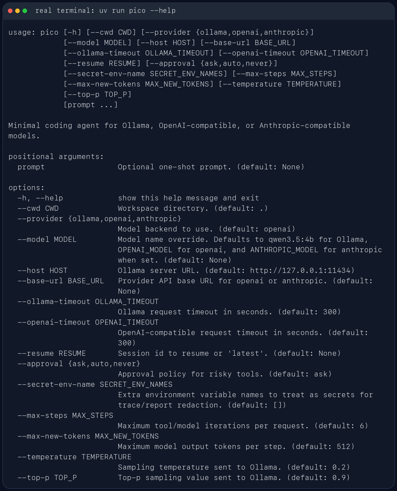
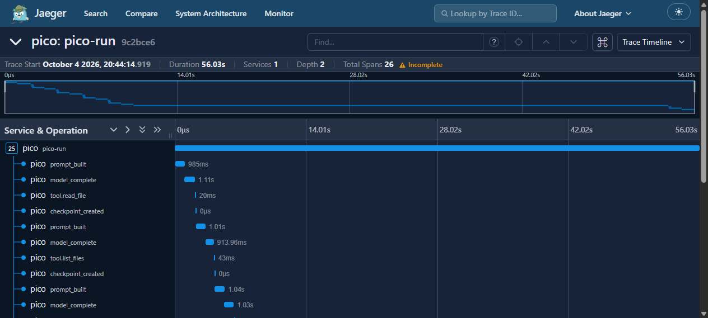
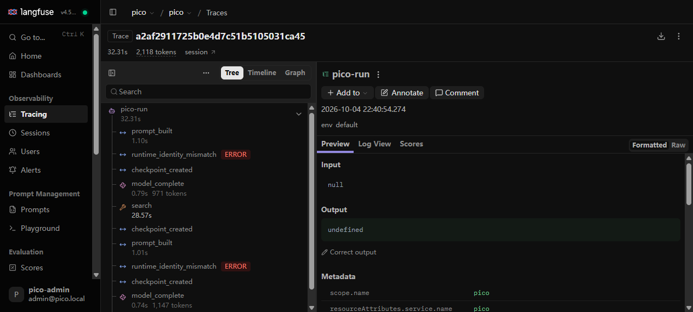

# tether

`tether` 是一个面向代码仓库的轻量本地 coding agent。它直接跑在终端里，先看当前工作区，再用一组受约束的工具去读文件、改文件、跑命令，并把会话状态保存在本地 `.tether/` 目录里。

它更像一个能在仓库里持续工作的命令行助手，不是纯聊天窗口。你可以拿它做代码排查、测试修复、仓库分析，或者让它在当前项目里执行一次性的工程任务。

## 适合做什么

- 在本地仓库里排查测试失败
- 读取当前代码结构并给出修改建议
- 基于现有文件做小步迭代，而不是脱离仓库空想
- 在会话中保留上下文，支持继续上一次工作

## 主要特性

- 包名是 `tether`
- CLI 命令是 `tether`
- 模块入口是 `python -m tether`
- 会话保存在 `.tether/sessions/`
- 每次运行的工件保存在 `.tether/runs/<run_id>/`
- 可选的外部追踪：设 `TETHER_TRACING=otel` 后按 OpenTelemetry GenAI 语义约定上报 span（详见 `09-可观测性与外部追踪接入.md`），上报比例用 `TETHER_TRACING_SAMPLE_RATE` 控制，默认 1
- 支持四类模型后端：
  - Ollama
  - OpenAI 兼容 Responses API
  - Anthropic 兼容 Messages API
  - DeepSeek Anthropic 兼容 API

## 使用截图

CLI 帮助信息：



启动界面：


REPL 内置命令与会话路径：


外部追踪（Jaeger）里的 span 时间线：



外部追踪（Langfuse）里的单条 trace 树与 token 汇总：



## 安装

需要 Python 3.10+。

如果你用 `uv`，直接安装依赖：

```bash
uv sync
```

如果你已经在自己的 Python 环境里工作，也可以直接装成可编辑模式：

```bash
pip install -e .
```

## 快速开始

在当前仓库里启动交互模式。默认 provider 是 DeepSeek：

```bash
uv run tether
```

指定另一个工作目录：

```bash
uv run tether --cwd /path/to/repo
```

直接跑一次性任务：

```bash
uv run tether "inspect the test failures and propose a fix"
```

如果当前环境已经安装过包，也可以直接这样启动：

```bash
python -m tether
```

## 模型后端

Tether 启动时会读取项目根目录的 `.env`。本地真实 key 放在 `.env`，仓库只保留 `.env.example`。配置优先级是：

```text
显式 CLI 参数 > .env 里的 TETHER_* 变量 > 旧环境变量 > 代码默认值
```

Provider 选择的具体顺序是：

```text
--provider > TETHER_PROVIDER > 代码默认 deepseek
```

不传 `--provider` 且没有 `TETHER_PROVIDER` 时默认使用 `deepseek`。这是推荐配置路径：DeepSeek 的 Anthropic-compatible endpoint 比本地 Ollama 更少依赖本机模型环境，也比 OpenAI-compatible/Anthropic-compatible 代理少一层默认 gateway 假设。其他 provider 仍然保留，可以在 `.env` 里写 `TETHER_PROVIDER=openai`、`TETHER_PROVIDER=anthropic`、`TETHER_PROVIDER=ollama`，也可以显式传 `--provider openai`、`--provider anthropic` 或 `--provider ollama`。

`.env` 会在构建 provider client 前加载，并覆盖当前进程里的同名环境变量。模型名和 base URL 可以通过 `--model`、`--base-url` 临时覆盖；API key 只从环境变量读取。

本地第一次配置：

```bash
cp .env.example .env
```

然后把要使用的 provider key 填进去。`.env` 已经被 `.gitignore` 忽略，不要提交真实 key。

### 推荐配置：DeepSeek

最小配置只需要 key：

```bash
TETHER_DEEPSEEK_API_KEY="your-api-key"
```

默认模型和接口是：

```bash
TETHER_DEEPSEEK_API_BASE="https://api.deepseek.com/anthropic"
TETHER_DEEPSEEK_MODEL="deepseek-flash"
```

所以常规情况下 `.env` 里只填 `TETHER_DEEPSEEK_API_KEY` 就能直接启动：

```bash
uv run tether
```

如果你需要临时切模型或代理地址，不必改 `.env`，可以直接覆盖：

```bash
uv run tether --model deepseek-v4-pro --base-url https://api.deepseek.com/anthropic
```

DeepSeek 当前走 Anthropic-compatible Messages API，所以 runtime 里复用的是 Anthropic-compatible client；这只影响 HTTP 协议，不影响 CLI 用法。

### 可选配置：right.codes

right.codes 在 Tether 里有两条可选 provider 路径：

- `--provider openai`：走 OpenAI-compatible `/responses`，默认 base URL 是 `https://www.right.codes/codex/v1`，默认模型是 `gpt-5.4`
- `--provider anthropic`：走 Anthropic-compatible `/messages`，默认 base URL 是 `https://www.right.codes/claude/v1`，默认模型是 `claude-sonnet-4-6`

如果 right.codes 给你的是一把共享 key，推荐只填这一项：

```bash
TETHER_RIGHT_CODES_API_KEY="your-right-codes-key"
```

然后按需要选择 provider：

```bash
uv run tether --provider openai
uv run tether --provider anthropic
```

如果你想显式区分两条 provider 的 key，也可以分别配置：

```bash
TETHER_OPENAI_API_KEY="your-right-codes-key-for-codex"
TETHER_ANTHROPIC_API_KEY="your-right-codes-key-for-claude"
```

不要在 `.env` 里写 `TETHER_OPENAI_API_KEY=$TETHER_RIGHT_CODES_API_KEY` 这种 shell 展开形式；Tether 的 `.env` 解析器只读取字面量，不展开变量引用。要么只写 `TETHER_RIGHT_CODES_API_KEY`，要么把 key 字符串分别填到 provider-specific 变量里。

如果请求 right.codes 返回 `API Key额度不足`，说明协议和 endpoint 已经打通，但当前 key 没有可用额度；换一把有额度的 key，或到 right.codes 后台处理额度。

当前 provider 环境变量：

| provider | base URL | API key | model |
| --- | --- | --- | --- |
| `deepseek` | `TETHER_DEEPSEEK_API_BASE`，回退 `DEEPSEEK_API_BASE`，默认 `https://api.deepseek.com/anthropic` | `TETHER_DEEPSEEK_API_KEY`，回退 `DEEPSEEK_API_KEY` | `TETHER_DEEPSEEK_MODEL`，回退 `DEEPSEEK_MODEL`，默认 `deepseek-flash` |
| `openai` | `TETHER_OPENAI_API_BASE`，回退 `OPENAI_API_BASE`，默认 `https://www.right.codes/codex/v1` | `TETHER_OPENAI_API_KEY`，回退 `OPENAI_API_KEY`、`TETHER_RIGHT_CODES_API_KEY`、`RIGHT_CODES_API_KEY`、`TETHER_ANTHROPIC_API_KEY`、`ANTHROPIC_API_KEY` | `TETHER_OPENAI_MODEL`，回退 `OPENAI_MODEL`，默认 `gpt-5.4` |
| `anthropic` | `TETHER_ANTHROPIC_API_BASE`，回退 `ANTHROPIC_API_BASE`，默认 `https://www.right.codes/claude/v1` | `TETHER_ANTHROPIC_API_KEY`，回退 `ANTHROPIC_API_KEY`、`TETHER_RIGHT_CODES_API_KEY`、`RIGHT_CODES_API_KEY`、`TETHER_OPENAI_API_KEY`、`OPENAI_API_KEY` | `TETHER_ANTHROPIC_MODEL`，回退 `ANTHROPIC_MODEL`，默认 `claude-sonnet-4-6` |
| `ollama` | `--host`，默认 `http://127.0.0.1:11434` | 不需要 | `--model`，默认 `qwen3.5:4b` |

如果有额外的敏感环境变量需要从 trace/report 里脱敏，可以用 `TETHER_SECRET_ENV_NAMES` 配置逗号分隔的变量名，或启动时重复传 `--secret-env-name NAME`。

### OpenAI 兼容接口

如果要改用 OpenAI-compatible `/responses` 服务，显式传 `--provider openai`：

```bash
uv run tether --provider openai
```

默认 OpenAI 兼容接口使用 right.codes 的 Codex endpoint：

```bash
TETHER_OPENAI_API_BASE="https://www.right.codes/codex/v1"
TETHER_RIGHT_CODES_API_KEY="your-right-codes-key"
TETHER_OPENAI_MODEL="gpt-5.4"
```

也可以改成其他 OpenAI-compatible 服务：

```bash
TETHER_OPENAI_API_BASE="https://your-api.example/v1"
TETHER_OPENAI_API_KEY="your-api-key"
TETHER_OPENAI_MODEL="gpt-5.4"
```

### Anthropic 兼容接口

如果要改用 Anthropic-compatible 服务，显式传 `--provider anthropic`：

```bash
uv run tether --provider anthropic
```

默认 Anthropic 兼容接口使用 right.codes 的 Claude endpoint：

```bash
TETHER_ANTHROPIC_API_BASE="https://www.right.codes/claude/v1"
TETHER_RIGHT_CODES_API_KEY="your-right-codes-key"
TETHER_ANTHROPIC_MODEL="claude-sonnet-4-6"
```

如果你的服务端对多个兼容接口复用了同一套密钥，`tether` 也支持从 `TETHER_ANTHROPIC_API_KEY` 回退到 `ANTHROPIC_API_KEY`、`TETHER_RIGHT_CODES_API_KEY`、`RIGHT_CODES_API_KEY`、`TETHER_OPENAI_API_KEY` 或 `OPENAI_API_KEY`。

### Ollama

如果要改用本地 Ollama，显式传 `--provider ollama`：

```bash
ollama serve
ollama pull qwen3.5:4b
uv run tether --provider ollama --model qwen3.5:4b
```

## 常用交互命令

- `/help`：查看内置命令
- `/memory`：查看提炼后的工作记忆
- `/session`：查看当前会话文件路径
- `/reset`：清空当前会话状态
- `/exit` 或 `/quit`：退出 REPL

## 安全与持久化

`tether` 不会默认把所有动作都放开。像 shell 执行、文件写入这类高风险操作，会受审批模式控制：

- `--approval ask`
- `--approval auto`
- `--approval never`

每次运行结束后，都会在 `.tether/runs/<run_id>/` 下写出这些文件：

- `task_state.json`
- `trace.jsonl`
- `report.json`

这些内容默认只保存在本地，不需要跟仓库一起提交。

## 开发

常用本地检查：

```bash
uv run pytest tests -q
uv run ruff check tether tests scripts
```

内部代码现在按较轻的边界拆分：`tether/evaluation/` 放 benchmark 和 metrics，`tether/providers/` 放模型 provider client，`tether/features/` 放可选运行时能力。新代码应直接使用这些包路径；旧的 `tether.evaluator`、`tether.metrics`、`tether.models` 和 `tether.memory` import 不再作为公共入口保留。
